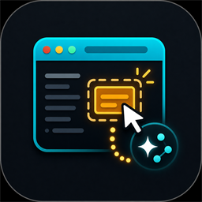

# Visual Edit

  

  <strong>An embedded browser panel right inside VS Code and Antigravity. Stop switching windows and start previewing your workspace instantly!</strong>

  
  
  
  
  

## ✨ Key Features

- 🌐 **Embedded Browser**: Open a full-featured web browser directly inside a VS Code webview panel.
- ⚡ **HMR Aware Auto-Reload**: Automatically reloads the panel when a workspace file is saved. Skips full-page reloads for file types natively handled by Hot Module Replacement (Vite, Webpack, etc.), keeping your application state intact.
- 📰 **Support for local static files**: Supports opening local static files, either by pressing on a file and selecting "Open in Visual Edit" from the context menu, or by entering the file path into the address bar.
- 🔍 **Inspect Elements**: Native integration allowing you to click an element in the browser panel and jump straight to its source code in your editor.
- 🛠 **Integrated DevTools (Console & Network)**: View `console.log` and `fetch`/`XHR` network requests in VS Code without opening an external browser's DevTools.
  - *How to use*: Press `Ctrl+Shift+U` (or `Cmd+Shift+U` on macOS) to open the Output panel, then select **"Visual Edit — Console"** or **"Visual Edit — Network"** from the dropdown menu.
- 🔗 **Terminal Link Interception**: Clicking a `localhost` URL in your VS Code terminal automatically opens it in the Visual Edit panel instead of your system browser.

---

## ⌨️ Commands

Access these via the Command Palette (`Ctrl+Shift+P` / `Cmd+Shift+P`):

| Command Title | ID | Default Keybinding |
| :--- | :--- | :--- |
| **Open Visual Edit** | `vscode-visual-edit.open` | `Ctrl+Shift+B` / `Cmd+Shift+B` |
| **Open URL in Visual Edit** | `vscode-visual-edit.navigate` | `Ctrl+Shift+L` / `Cmd+Shift+L` |

---

## ⚙️ Extension Settings

Customize the extension's behavior through `settings.json` or the VS Code Settings UI:

| Setting Key | Type | Default | Description |
| :--- | :--- | :--- | :--- |
| `vscode-visual-edit.defaultUrl` | `string` | `http://localhost:3000` | The default URL opened when Visual Edit is launched. |
| `vscode-visual-edit.autoReload` | `boolean` | `true` | Reloads the browser when a workspace file is saved. |
| `vscode-visual-edit.hmrAware` | `boolean` | `true` | Skips auto-reload for `.js, .ts, .css, .vue, .svelte` files so HMR can handle them. |
| `vscode-visual-edit.consoleOutput` | `string` | `"all"` | Minimum log level to mirror to the output channel (`all`, `warn`, `error`, `none`). |
| `vscode-visual-edit.networkInspector` | `boolean` | `true` | Log `fetch` and `XHR` requests from the active page to the Network output channel. |
| `vscode-visual-edit.terminalLinks` | `boolean` | `true` | If enabled, terminal URLs open in the extension instead of the system browser. |

---

## 🛡️ Security & Privacy

This extension is built with robust isolation to ensure your host machine remains secure:

- **Localhost Proxy Binding**: The internal development proxy only binds to `127.0.0.1`, meaning other devices on your local network cannot use your machine as an open proxy.
- **SSRF Mitigation**: The proxy explicitly refuses to route non-localhost URLs (e.g., `https://example.com`), mitigating Server-Side Request Forgery vulnerabilities.
- **Restricted Resource Roots**: The webview panel utilizes strict `localResourceRoots`, ensuring scripts loaded inside the browser tab cannot read arbitrary files from your hard drive via the extension context.

---

## 🧪 Testing & Reliability

Visual Edit is built for enterprise reliability:

- **Continuous Integration**: 100% automated testing pipeline running on GitHub Actions across **Ubuntu Linux, macOS, and Windows**.
- **Coverage**: Maintains **>90% code coverage** through a combination of fast `vitest` unit tests and rigorous `Mocha`/Electron integration tests running inside a real VS Code extension host.

---

## Release Notes

For a full history of changes, see the [CHANGELOG.md](CHANGELOG.md).

---

## Credits

Original extension by [AdiHaAgadi](https://github.com/AdiHaAgadi/vscode-browser-tab).

**Inspect-to-Chat for Antigravity** — click an element in the browser preview to send its full context (selector, computed styles, DOM context, source location, and more) straight into the Antigravity agent chat — added by **Mordi**.
